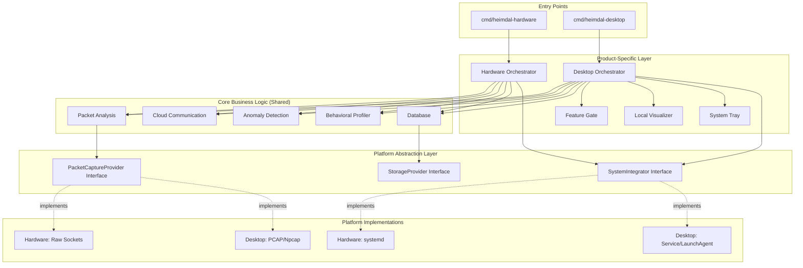

# Design Document

## Overview

This design document describes the architectural transformation of Heimdal from a single hardware-focused product into a unified monorepo supporting two distinct product lines: Heimdal Hardware (Raspberry Pi sensor) and Heimdal Desktop (cross-platform software agent). The design maximizes code reuse for core functionality while maintaining strict separation of platform-specific concerns through interface-based abstractions.

### Key Design Goals

1. **Maximum Code Reuse**: Share packet analysis, cloud communication, anomaly detection, and behavioral profiling logic between both products
2. **Clean Separation**: Isolate platform-specific implementations (deployment, OS integration, UI) from core business logic
3. **Interface-Driven Architecture**: Use Go interfaces to enable swappable implementations for different platforms
4. **Maintainability**: Organize code to make it clear which modules are shared vs platform-specific
5. **Backward Compatibility**: Ensure existing hardware deployments continue to work during and after the transition

### Product Comparison

| Aspect | Heimdal Hardware | Heimdal Desktop |
|--------|------------------|-----------------|
| **Platform** | Raspberry Pi (ARM64 Linux) | Windows, macOS, Linux (x86_64/ARM64) |
| **Deployment** | Dedicated hardware device | Software installation on user's computer |
| **Network Position** | Router-level (protects entire subnet) | Host-level (runs on endpoint) |
| **Packet Capture** | Raw sockets / AF_PACKET | gopacket with PCAP/Npcap |
| **System Integration** | systemd service | Windows Service / macOS LaunchAgent / System Tray |
| **UI** | Web dashboard only | Web dashboard + native system tray |
| **Business Model** | Hardware sale + optional cloud | SaaS with Free/Pro tiers |
| **Feature Gating** | All features enabled | Tier-based (Free: read-only, Pro: blocking) |

## Architecture

### High-Level Monorepo Structure

```
heimdal/
├── cmd/
│   ├── heimdal-hardware/        # Hardware entry point
│   │   └── main.go
│   └── heimdal-desktop/         # Desktop entry point
│       └── main.go
├── internal/
│   ├── core/                    # Shared business logic
│   │   ├── packet/             # Packet analysis
│   │   ├── cloud/              # Cloud communication
│   │   ├── detection/          # Anomaly detection
│   │   ├── profiler/           # Behavioral profiling
│   │   └── database/           # Data persistence
│   ├── platform/               # Platform abstractions
│   │   ├── interfaces.go       # Core interfaces
│   │   ├── linux_embedded/     # Raspberry Pi implementations
│   │   ├── desktop_windows/    # Windows implementations
│   │   ├── desktop_macos/      # macOS implementations
│   │   └── desktop_linux/      # Linux desktop implementations
│   ├── hardware/               # Hardware-specific logic
│   │   ├── orchestrator/       # Hardware orchestrator
│   │   └── config/             # Hardware configuration
│   └── desktop/                # Desktop-specific logic
│       ├── orchestrator/       # Desktop orchestrator
│       ├── featuregate/        # Tier management
│       ├── visualizer/         # Local dashboard
│       ├── installer/          # Installation logic
│       └── systray/            # System tray integration
├── web/
│   └── dashboard/              # Shared web UI
├── pkg/                        # Public APIs (if needed)
├── test/
│   ├── integration/            # Integration tests
│   └── mocks/                  # Mock implementations
├── build/
│   ├── package/                # Packaging scripts
│   └── installers/             # Installer configurations
├── Makefile                    # Build system
└── go.mod
```

### Architecture Diagram



## Components and Interfaces

### Core Interfaces (internal/platform/interfaces.go)

These interfaces define the contracts that platform-specific implementations must fulfill:

#### PacketCaptureProvider Interface

```go
// PacketCaptureProvider abstracts packet capture mechanisms across platforms
type PacketCaptureProvider interface {
    // Open initializes packet capture on the specified interface
    Open(interfaceName string, promiscuous bool, filter string) error
    
    // ReadPacket returns the next captured packet
    // Returns nil packet when no more packets are available
    ReadPacket() (*Packet, error)
    
    // Close releases packet capture resources
    Close() error
    
    // GetStats returns capture statistics (packets captured, dropped, etc.)
    GetStats() (*CaptureStats, error)
}

// Packet represents a captured network packet with parsed metadata
type Packet struct {
    Timestamp    time.Time
    SrcMAC       net.HardwareAddr
    DstMAC       net.HardwareAddr
    SrcIP        net.IP
    DstIP        net.IP
    SrcPort      uint16
    DstPort      uint16
    Protocol     string
    PayloadSize  uint32
    RawData      []byte  // Optional: full packet data
}

// CaptureStats contains packet capture statistics
type CaptureStats struct {
    PacketsCaptured uint64
    PacketsDropped  uint64
    PacketsFiltered uint64
}
```

**Implementations:**
- **Hardware (linux_embedded)**: Uses raw sockets or AF_PACKET for high-performance capture
- **Desktop Windows (desktop_windows)**: Uses gopacket with Npcap, handles Npcap installation checks
- **Desktop macOS (desktop_macos)**: Uses gopacket with libpcap, handles permission requests
- **Desktop Linux (desktop_linux)**: Uses gopacket with libpcap, handles capability requirements

#### SystemIntegrator Interface

```go
// SystemIntegrator abstracts OS-level service integration
type SystemIntegrator interface {
    // Install registers the application with the OS (service/daemon/LaunchAgent)
    Install(config *InstallConfig) error
    
    // Uninstall removes the application from OS registration
    Uninstall() error
    
    // Start begins the service/daemon
    Start() error
    
    // Stop halts the service/daemon
    Stop() error
    
    // Restart stops and starts the service/daemon
    Restart() error
    
    // GetStatus returns the current service status
    GetStatus() (*ServiceStatus, error)
    
    // EnableAutoStart configures the service to start on boot
    EnableAutoStart(enabled bool) error
}

// InstallConfig contains installation parameters
type InstallConfig struct {
    ServiceName  string
    DisplayName  string
    Description  string
    ExecutablePath string
    Arguments    []string
    WorkingDir   string
    User         string  // Optional: run as specific user
}

// ServiceStatus represents the current state of the service
type ServiceStatus struct {
    IsRunning    bool
    IsInstalled  bool
    AutoStart    bool
    PID          int
    Uptime       time.Duration
}
```

**Implementations:**
- **Hardware (linux_embedded)**: systemd service management
- **Desktop Windows (desktop_windows)**: Windows Service API
- **Desktop macOS (desktop_macos)**: LaunchAgent/LaunchDaemon plist management
- **Desktop Linux (desktop_linux)**: systemd user service or system tray application

#### StorageProvider Interface

```go
// StorageProvider abstracts data persistence across platforms
type StorageProvider interface {
    // Open initializes the storage backend
    Open(path string, options *StorageOptions) error
    
    // Close releases storage resources
    Close() error
    
    // Get retrieves a value by key
    Get(key string) ([]byte, error)
    
    // Set stores a value with the given key
    Set(key string, value []byte) error
    
    // Delete removes a key-value pair
    Delete(key string) error
    
    // List returns all keys matching the prefix
    List(prefix string) ([]string, error)
    
    // Batch performs multiple operations atomically
    Batch(ops []BatchOp) error
}

// StorageOptions contains storage configuration
type StorageOptions struct {
    ReadOnly     bool
    SyncWrites   bool
    CacheSize    int64
}

// BatchOp represents a single operation in a batch
type BatchOp struct {
    Type  BatchOpType  // Set or Delete
    Key   string
    Value []byte
}
```

**Implementations:**
- **Hardware**: BadgerDB at `/var/lib/heimdal/db`
- **Desktop Windows**: BadgerDB at `%APPDATA%/Heimdal/db`
- **Desktop macOS**: BadgerDB at `~/Library/Application Support/Heimdal/db`
- **Desktop Linux**: BadgerDB at `~/.local/share/heimdal/db`

### Core Shared Components

#### Packet Analysis Module (internal/core/packet/)

Shared packet parsing and analysis logic that works with any PacketCaptureProvider implementation.

```go
// Analyzer processes packets from any capture provider
type Analyzer struct {
    provider     platform.PacketCaptureProvider
    rateLimiter  *rate.Limiter
    outputChan   chan<- *PacketInfo
}

// PacketInfo contains extracted packet metadata
type PacketInfo struct {
    Timestamp   time.Time
    SrcMAC      string
    DstIP       string
    DstPort     uint16
    Protocol    string
    Size        uint32
}

// Start begins packet analysis
func (a *Analyzer) Start(ctx context.Context) error

// ProcessPacket extracts metadata from a packet
func (a *Analyzer) ProcessPacket(packet *platform.Packet) (*PacketInfo, error)
```

#### Cloud Communication Module (internal/core/cloud/)

Shared cloud connector logic for both AWS IoT and Google Cloud, with device type metadata.

```go
// Connector handles cloud communication
type Connector interface {
    Connect() error
    Disconnect() error
    SendProfile(profile *ProfileData, deviceType DeviceType) error
    SendDevice(device *DeviceData, deviceType DeviceType) error
    SendAnomaly(anomaly *AnomalyData, deviceType DeviceType) error
    IsConnected() bool
}

// DeviceType distinguishes hardware vs desktop deployments
type DeviceType string

const (
    DeviceTypeHardware DeviceType = "hardware"
    DeviceTypeDesktop  DeviceType = "desktop"
)
```

#### Anomaly Detection Module (internal/core/detection/)

Shared anomaly detection algorithms that analyze behavioral profiles.

```go
// Detector identifies anomalous behavior patterns
type Detector struct {
    sensitivity  float64
    baselineDB   storage.Provider
}

// Anomaly represents a detected anomalous behavior
type Anomaly struct {
    DeviceMAC    string
    Type         AnomalyType
    Severity     Severity
    Description  string
    Timestamp    time.Time
    Evidence     map[string]interface{}
}

// AnomalyType categorizes the type of anomaly
type AnomalyType string

const (
    AnomalyUnexpectedDestination AnomalyType = "unexpected_destination"
    AnomalyUnusualPort          AnomalyType = "unusual_port"
    AnomalyTrafficSpike         AnomalyType = "traffic_spike"
    AnomalyNewDevice            AnomalyType = "new_device"
)

// Analyze examines a profile for anomalies
func (d *Detector) Analyze(profile *BehavioralProfile) ([]*Anomaly, error)
```

#### Behavioral Profiler Module (internal/core/profiler/)

Shared profiling logic that aggregates packet metadata into behavioral profiles.

```go
// Profiler aggregates packet data into behavioral profiles
type Profiler struct {
    db              storage.Provider
    packetChan      <-chan *packet.PacketInfo
    profiles        map[string]*BehavioralProfile
    persistInterval time.Duration
}

// BehavioralProfile represents aggregated behavior for a device
type BehavioralProfile struct {
    MAC              string
    Destinations     map[string]int  // IP -> packet count
    Ports            map[uint16]int  // Port -> frequency
    Protocols        map[string]int  // Protocol -> count
    TotalPackets     uint64
    TotalBytes       uint64
    HourlyActivity   [24]uint64      // Packets per hour
    FirstSeen        time.Time
    LastSeen         time.Time
}
```

### Desktop-Specific Components

#### Feature Gate Module (internal/desktop/featuregate/)

Manages tier-based feature access for the SaaS model.

```go
// FeatureGate enforces tier-based feature access
type FeatureGate struct {
    currentTier  Tier
    licenseKey   string
    validator    LicenseValidator
}

// Tier represents subscription levels
type Tier string

const (
    TierFree       Tier = "free"
    TierPro        Tier = "pro"
    TierEnterprise Tier = "enterprise"
)

// Feature represents a gated feature
type Feature string

const (
    FeatureNetworkVisibility Feature = "network_visibility"  // Free+
    FeatureTrafficBlocking   Feature = "traffic_blocking"    // Pro+
    FeatureAdvancedFiltering Feature = "advanced_filtering"  // Pro+
    FeatureCloudSync         Feature = "cloud_sync"          // Pro+
    FeatureMultiDevice       Feature = "multi_device"        // Enterprise
    FeatureAPIAccess         Feature = "api_access"          // Enterprise
)

// CanAccess checks if the current tier can access a feature
func (fg *FeatureGate) CanAccess(feature Feature) bool

// GetTier returns the current subscription tier
func (fg *FeatureGate) GetTier() Tier

// UpgradeTier attempts to upgrade to a new tier with license validation
func (fg *FeatureGate) UpgradeTier(licenseKey string) error
```

#### Local Visualizer Module (internal/desktop/visualizer/)

Provides the web dashboard with real-time network visualization.

```go
// Visualizer serves the local web dashboard
type Visualizer struct {
    db          storage.Provider
    server      *http.Server
    wsHub       *WebSocketHub
    featureGate *featuregate.FeatureGate
}

// Start begins serving the dashboard
func (v *Visualizer) Start(port int) error

// WebSocketHub manages real-time updates to connected clients
type WebSocketHub struct {
    clients    map[*WebSocketClient]bool
    broadcast  chan *UpdateMessage
    register   chan *WebSocketClient
    unregister chan *WebSocketClient
}

// UpdateMessage represents a real-time update
type UpdateMessage struct {
    Type    string      // "device", "traffic", "anomaly"
    Payload interface{}
}
```

#### System Tray Module (internal/desktop/systray/)

Provides native OS integration with system tray/menu bar.

```go
// SystemTray manages the system tray icon and menu
type SystemTray struct {
    icon        *systray.Icon
    menu        *systray.Menu
    status      Status
    visualizer  *visualizer.Visualizer
}

// Status represents the monitoring status
type Status string

const (
    StatusActive  Status = "active"
    StatusPaused  Status = "paused"
    StatusError   Status = "error"
)

// Initialize sets up the system tray
func (st *SystemTray) Initialize() error

// UpdateStatus changes the icon to reflect current status
func (st *SystemTray) UpdateStatus(status Status)

// ShowNotification displays a desktop notification
func (st *SystemTray) ShowNotification(title, message string, severity NotificationSeverity)
```

## Data Models

### Device Model

```go
// Device represents a discovered network device
type Device struct {
    MAC        string    `json:"mac"`
    IP         string    `json:"ip"`
    Name       string    `json:"name"`
    Vendor     string    `json:"vendor"`
    IsActive   bool      `json:"is_active"`
    FirstSeen  time.Time `json:"first_seen"`
    LastSeen   time.Time `json:"last_seen"`
    DeviceType string    `json:"device_type"`  // e.g., "IoT", "Computer", "Mobile"
}
```

### Behavioral Profile Model

```go
// BehavioralProfile aggregates traffic patterns for a device
type BehavioralProfile struct {
    MAC              string             `json:"mac"`
    Destinations     map[string]int     `json:"destinations"`      // IP -> count
    Ports            map[uint16]int     `json:"ports"`             // Port -> count
    Protocols        map[string]int     `json:"protocols"`         // Protocol -> count
    TotalPackets     uint64             `json:"total_packets"`
    TotalBytes       uint64             `json:"total_bytes"`
    HourlyActivity   [24]uint64         `json:"hourly_activity"`
    FirstSeen        time.Time          `json:"first_seen"`
    LastSeen         time.Time          `json:"last_seen"`
}
```

### Configuration Model

```go
// Config represents the unified configuration format
type Config struct {
    // Common settings
    Database    DatabaseConfig    `json:"database"`
    Discovery   DiscoveryConfig   `json:"discovery"`
    Interceptor InterceptorConfig `json:"interceptor"`
    Profiler    ProfilerConfig    `json:"profiler"`
    Cloud       CloudConfig       `json:"cloud"`
    API         APIConfig         `json:"api"`
    
    // Desktop-specific settings
    Desktop     *DesktopConfig    `json:"desktop,omitempty"`
}

// DesktopConfig contains desktop-specific settings
type DesktopConfig struct {
    FeatureGate  FeatureGateConfig  `json:"feature_gate"`
    SystemTray   SystemTrayConfig   `json:"system_tray"`
    AutoStart    bool               `json:"auto_start"`
    UpdateCheck  bool               `json:"update_check"`
}

// FeatureGateConfig contains tier and licensing settings
type FeatureGateConfig struct {
    Tier       string `json:"tier"`        // "free", "pro", "enterprise"
    LicenseKey string `json:"license_key"`
}
```


## Correctness Properties

*A property is a characteristic or behavior that should hold true across all valid executions of a system-essentially, a formal statement about what the system should do. Properties serve as the bridge between human-readable specifications and machine-verifiable correctness guarantees.*

Based on the prework analysis, the following correctness properties have been identified for automated testing:

### Property 1: Packet Parser Interface Compatibility

*For any* implementation of PacketCaptureProvider, the shared packet analysis module should successfully parse packets from that provider without errors.

**Validates: Requirements 2.4**

### Property 2: Packet Metadata Extraction Completeness

*For any* valid network packet, the packet analysis module should extract all required fields (protocol, source/destination addresses, ports) and return a complete PacketInfo structure.

**Validates: Requirements 2.5**

### Property 3: ARP Spoofing Packet Correctness

*For any* target device (IP, MAC pair), the DesktopTrafficInterceptor should generate ARP spoofing packets with correctly spoofed source information.

**Validates: Requirements 3.1**

### Property 4: Device API Response Completeness

*For any* set of discovered devices, the LocalVisualizer API should return JSON responses containing all required fields (IP, MAC, device name) for each device.

**Validates: Requirements 4.2**

### Property 5: Real-time Update Propagation

*For any* new traffic event, the LocalVisualizer should send WebSocket updates to all connected clients within a reasonable time window.

**Validates: Requirements 4.4**

### Property 6: API Endpoint JSON Validity

*For any* API endpoint in the LocalVisualizer, responses should be valid JSON and include expected fields for the endpoint type.

**Validates: Requirements 4.5**

### Property 7: Feature Gate Access Control

*For any* protected operation and tier level, the FeatureGating module should correctly allow or deny access based on the tier's permissions.

**Validates: Requirements 5.4**

### Property 8: Feature Gate Error Messages

*For any* denied feature access, the FeatureGating module should return an error message that clearly identifies the required tier.

**Validates: Requirements 5.5**

### Property 9: Cloud Message Type Support

*For any* message type (device discovery, behavioral profile, anomaly alert), the shared cloud connector should successfully serialize and transmit the message.

**Validates: Requirements 9.4**

### Property 10: Cloud Metadata Inclusion

*For any* cloud transmission, the message should include device type metadata (hardware or desktop) in the payload.

**Validates: Requirements 9.5**

### Property 11: Cloud Authentication Consistency

*For any* cloud transmission from either product, the same authentication and encryption mechanisms should be applied.

**Validates: Requirements 9.6**

### Property 12: Anomaly Detection Pattern Recognition

*For any* behavioral profile with known anomalous patterns (unexpected destinations, unusual ports, traffic spikes), the anomaly detection module should identify and flag the anomaly.

**Validates: Requirements 10.2, 10.3**

### Property 13: Anomaly Alert Structure

*For any* detected anomaly, the generated alert should include severity level, description, and evidence fields.

**Validates: Requirements 10.4**

### Property 14: Anomaly Detection Sensitivity

*For any* configurable sensitivity threshold, the anomaly detection module should adjust its detection behavior accordingly.

**Validates: Requirements 10.5**

### Property 15: Network Interface Auto-Detection

*For any* system with at least one active network interface, the Desktop product should successfully detect and select a primary interface.

**Validates: Requirements 11.5**

### Property 16: Event Notification Triggering

*For any* important event (new device, anomaly), the Desktop product should trigger a desktop notification with appropriate content.

**Validates: Requirements 12.4**

### Property 17: Configuration Validation

*For any* invalid configuration file, the application should detect the invalidity on startup and provide a clear error message identifying the problem.

**Validates: Requirements 13.5**

### Property 18: Configuration Hot-Reload

*For any* configuration change to hot-reloadable settings, the application should apply the changes without requiring a restart.

**Validates: Requirements 13.6**

### Property 19: Backward Configuration Compatibility

*For any* configuration file from the existing hardware codebase, the new monorepo version should successfully parse and apply the settings.

**Validates: Requirements 15.3**

## Error Handling

### Error Handling Strategy

The monorepo architecture maintains the existing error handling patterns from the hardware implementation while extending them for desktop-specific scenarios:

#### Core Error Handling Principles

1. **Graceful Degradation**: Component failures should not crash the entire application
2. **Retry with Backoff**: Transient errors retry with exponential backoff
3. **Clear Error Messages**: All errors include context and actionable information
4. **Error Propagation**: Errors propagate to appropriate handlers (orchestrator, UI, logs)
5. **Platform-Specific Handling**: Desktop errors may trigger UI notifications, hardware errors log to systemd

#### Platform-Specific Error Scenarios

**Desktop Windows:**
- **Npcap Missing**: Detect on startup, show installation dialog with download link
- **Administrator Rights**: Detect insufficient permissions, prompt for elevation
- **Service Installation Failure**: Provide detailed error with troubleshooting steps

**Desktop macOS:**
- **libpcap Permissions**: Detect permission denial, guide user through System Preferences
- **LaunchAgent Registration**: Handle registration failures with clear error messages
- **Keychain Access**: Handle certificate/credential access errors gracefully

**Desktop Linux:**
- **Capability Missing**: Detect missing CAP_NET_RAW/CAP_NET_ADMIN, provide setcap command
- **systemd User Service**: Handle service registration failures
- **Display Server**: Handle system tray failures when no display server available

#### Feature Gate Error Handling

```go
// Example error handling for feature gate
func (fg *FeatureGate) CheckAccess(feature Feature) error {
    if !fg.CanAccess(feature) {
        return &FeatureAccessError{
            Feature:      feature,
            CurrentTier:  fg.currentTier,
            RequiredTier: fg.getRequiredTier(feature),
            Message:      fmt.Sprintf("Feature '%s' requires %s tier or higher", 
                                     feature, fg.getRequiredTier(feature)),
        }
    }
    return nil
}
```

#### Cloud Connector Error Handling

Both products use the same cloud error handling:
- **Connection Failures**: Retry with exponential backoff, continue local operations
- **Authentication Errors**: Log error, disable cloud sync, notify user
- **Transmission Failures**: Queue messages for retry (max 100 items)
- **Quota Exceeded**: Throttle transmissions, log warning

#### Packet Capture Error Handling

Platform-specific packet capture errors:
- **Interface Not Found**: List available interfaces, prompt user to select
- **Permission Denied**: Provide platform-specific guidance for granting permissions
- **Driver Missing**: Detect missing drivers (Npcap/libpcap), guide installation
- **Capture Timeout**: Retry with increased timeout, log warning

## Testing Strategy

### Overview

The monorepo testing strategy employs a multi-layered approach combining unit tests, property-based tests, integration tests, and platform-specific tests.

### Unit Testing

**Scope**: Individual functions and methods in isolation

**Coverage Areas**:
- Core packet parsing logic
- Anomaly detection algorithms
- Feature gate access control
- Configuration validation
- Data serialization/deserialization

**Tools**:
- Go's built-in `testing` package
- `testify` for assertions and mocks
- Mock implementations of platform interfaces

**Example**:
```go
func TestFeatureGate_CanAccess(t *testing.T) {
    tests := []struct {
        name     string
        tier     Tier
        feature  Feature
        expected bool
    }{
        {"Free tier can access visibility", TierFree, FeatureNetworkVisibility, true},
        {"Free tier cannot access blocking", TierFree, FeatureTrafficBlocking, false},
        {"Pro tier can access blocking", TierPro, FeatureTrafficBlocking, true},
    }
    
    for _, tt := range tests {
        t.Run(tt.name, func(t *testing.T) {
            fg := &FeatureGate{currentTier: tt.tier}
            result := fg.CanAccess(tt.feature)
            assert.Equal(t, tt.expected, result)
        })
    }
}
```

### Property-Based Testing

**Scope**: Universal properties that should hold across all inputs

**Framework**: `gopter` (Go property testing library)

**Property Test Configuration**:
- Minimum 100 iterations per property test
- Custom generators for domain-specific types (Packet, Device, Profile)
- Shrinking enabled to find minimal failing cases

**Key Properties to Test**:
1. Packet parser handles any valid packet structure
2. Anomaly detector identifies known anomalous patterns
3. Feature gate correctly enforces all tier combinations
4. Configuration validator catches all invalid configs
5. Cloud connector serializes all message types

**Example Property Test**:
```go
// Feature: monorepo-architecture, Property 7: Feature Gate Access Control
// Validates: Requirements 5.4
func TestProperty_FeatureGateAccessControl(t *testing.T) {
    properties := gopter.NewProperties(nil)
    
    properties.Property("Feature gate correctly enforces tier permissions", 
        prop.ForAll(
            func(tier Tier, feature Feature) bool {
                fg := &FeatureGate{currentTier: tier}
                canAccess := fg.CanAccess(feature)
                requiredTier := getRequiredTier(feature)
                
                // Property: can access if tier >= required tier
                return canAccess == (tier >= requiredTier)
            },
            genTier(),
            genFeature(),
        ))
    
    properties.TestingRun(t, gopter.ConsoleReporter(false))
}
```

**Property Test Tagging**:
Each property-based test MUST include a comment with:
- Feature name: `monorepo-architecture`
- Property number and description
- Requirements validation reference

### Integration Testing

**Scope**: Component interactions and interface implementations

**Coverage Areas**:
- PacketCaptureProvider implementations work with packet analyzer
- SystemIntegrator implementations correctly manage services
- StorageProvider implementations persist and retrieve data
- Cloud connector sends messages through real network stack
- Orchestrator correctly initializes and coordinates components

**Test Environment**:
- Docker containers for isolated testing
- Mock network interfaces for packet capture testing
- Temporary directories for storage testing
- Test cloud endpoints for connector testing

### Platform-Specific Testing

**Scope**: Platform-specific implementations and behaviors

**Approach**:
- Use build tags to separate platform-specific tests
- Run platform tests only on their target OS
- CI/CD pipeline runs tests on Windows, macOS, and Linux

**Build Tags**:
```go
// +build windows

package desktop_windows

func TestWindowsServiceIntegrator(t *testing.T) {
    // Windows-specific test
}
```

**Platform Test Coverage**:
- **Windows**: Npcap detection, Windows Service management, system tray
- **macOS**: libpcap permissions, LaunchAgent management, menu bar
- **Linux**: Capability detection, systemd user service, system tray

### Mock Implementations

**Purpose**: Enable testing of core logic without platform dependencies

**Mock Interfaces**:
```go
// MockPacketCaptureProvider for testing packet analysis
type MockPacketCaptureProvider struct {
    packets []*platform.Packet
    index   int
}

func (m *MockPacketCaptureProvider) Open(iface string, promisc bool, filter string) error {
    return nil
}

func (m *MockPacketCaptureProvider) ReadPacket() (*platform.Packet, error) {
    if m.index >= len(m.packets) {
        return nil, io.EOF
    }
    packet := m.packets[m.index]
    m.index++
    return packet, nil
}

func (m *MockPacketCaptureProvider) Close() error {
    return nil
}
```

### Test Organization

```
test/
├── unit/                    # Unit tests (co-located with source)
├── integration/             # Integration tests
│   ├── packet_capture_test.go
│   ├── cloud_connector_test.go
│   └── orchestrator_test.go
├── property/                # Property-based tests
│   ├── feature_gate_test.go
│   ├── anomaly_detection_test.go
│   └── packet_parser_test.go
├── platform/                # Platform-specific tests
│   ├── windows/
│   ├── macos/
│   └── linux/
└── mocks/                   # Mock implementations
    ├── mock_packet_capture.go
    ├── mock_system_integrator.go
    └── mock_storage.go
```

### Continuous Integration

**CI Pipeline**:
1. **Lint**: Run `golangci-lint` on all code
2. **Unit Tests**: Run all unit tests
3. **Property Tests**: Run all property-based tests (100 iterations)
4. **Integration Tests**: Run integration tests in Docker
5. **Platform Tests**: Run platform-specific tests on Windows, macOS, Linux VMs
6. **Coverage**: Generate coverage report, enforce 70% minimum for core modules
7. **Build**: Cross-compile all binaries to verify build success

**Test Execution Time Targets**:
- Unit tests: < 30 seconds
- Property tests: < 2 minutes
- Integration tests: < 5 minutes
- Platform tests: < 10 minutes per platform

## Migration Strategy

### Phase 1: Repository Restructuring (Week 1-2)

**Objective**: Reorganize existing code into monorepo structure without breaking functionality

**Tasks**:
1. Create new directory structure (cmd/, internal/core/, internal/platform/, internal/hardware/, internal/desktop/)
2. Move existing hardware code to internal/hardware/ and internal/platform/linux_embedded/
3. Identify shared logic and move to internal/core/
4. Update import paths throughout codebase
5. Ensure existing tests still pass
6. Update build scripts and Makefile

**Validation**:
- All existing tests pass
- Hardware binary builds successfully
- Ansible deployment works with new binary

### Phase 2: Interface Extraction (Week 3-4)

**Objective**: Define and implement platform abstraction interfaces

**Tasks**:
1. Define PacketCaptureProvider, SystemIntegrator, StorageProvider interfaces
2. Refactor existing hardware code to implement interfaces
3. Create mock implementations for testing
4. Update core modules to use interfaces instead of concrete types
5. Write integration tests for interface implementations

**Validation**:
- Core modules work with mock implementations
- Hardware product still functions correctly
- Integration tests pass

### Phase 3: Desktop Foundation (Week 5-6)

**Objective**: Implement basic desktop product structure

**Tasks**:
1. Create cmd/heimdal-desktop/ entry point
2. Implement desktop orchestrator
3. Implement platform-specific PacketCaptureProvider for Windows/macOS/Linux
4. Implement basic SystemIntegrator for each desktop platform
5. Implement desktop-specific configuration loading

**Validation**:
- Desktop binary builds for all platforms
- Basic packet capture works on each platform
- Configuration loads correctly

### Phase 4: Desktop Features (Week 7-8)

**Objective**: Implement desktop-specific features

**Tasks**:
1. Implement FeatureGate module
2. Implement LocalVisualizer with web dashboard
3. Implement system tray integration for each platform
4. Implement desktop notifications
5. Create onboarding wizard

**Validation**:
- Feature gating works correctly
- Dashboard displays network data
- System tray appears and functions
- Notifications trigger on events

### Phase 5: Installers and Packaging (Week 9-10)

**Objective**: Create installers for desktop platforms

**Tasks**:
1. Create Windows installer (NSIS/WiX) with Npcap bundling
2. Create macOS installer (DMG/PKG)
3. Create Linux packages (deb/rpm)
4. Implement auto-update mechanism
5. Create installation documentation

**Validation**:
- Installers work on clean systems
- Dependencies install correctly
- Auto-update functions properly

### Phase 6: Testing and Refinement (Week 11-12)

**Objective**: Comprehensive testing and bug fixes

**Tasks**:
1. Write property-based tests for all correctness properties
2. Achieve 70% code coverage for core modules
3. Perform platform-specific testing on real hardware
4. Fix bugs discovered during testing
5. Performance optimization

**Validation**:
- All property tests pass
- Coverage targets met
- No critical bugs remain
- Performance meets targets

### Backward Compatibility

**Configuration Files**:
- Support both old and new configuration formats during transition
- Provide migration tool to convert old configs to new format
- Log warnings when using deprecated config options

**API Compatibility**:
- Maintain existing API endpoints for hardware product
- Version API endpoints (v1, v2) to allow gradual migration

**Deployment**:
- Existing Ansible playbooks continue to work
- Provide updated playbooks for new features
- Document migration path for existing deployments

## Build System

### Makefile Targets

```makefile
# Build all binaries
.PHONY: build-all
build-all: build-hardware build-desktop-all

# Hardware binary (ARM64 Linux)
.PHONY: build-hardware
build-hardware:
	GOOS=linux GOARCH=arm64 CGO_ENABLED=1 \
	CC=aarch64-linux-gnu-gcc \
	go build -o bin/heimdal-hardware-arm64 \
	-ldflags="-s -w -extldflags '-static'" \
	./cmd/heimdal-hardware

# Desktop binaries
.PHONY: build-desktop-all
build-desktop-all: build-desktop-windows build-desktop-macos build-desktop-linux

.PHONY: build-desktop-windows
build-desktop-windows:
	GOOS=windows GOARCH=amd64 CGO_ENABLED=1 \
	CC=x86_64-w64-mingw32-gcc \
	go build -o bin/heimdal-desktop-windows.exe \
	-ldflags="-s -w -H windowsgui" \
	./cmd/heimdal-desktop

.PHONY: build-desktop-macos
build-desktop-macos:
	GOOS=darwin GOARCH=amd64 CGO_ENABLED=1 \
	go build -o bin/heimdal-desktop-macos-amd64 \
	-ldflags="-s -w" \
	./cmd/heimdal-desktop
	
	GOOS=darwin GOARCH=arm64 CGO_ENABLED=1 \
	go build -o bin/heimdal-desktop-macos-arm64 \
	-ldflags="-s -w" \
	./cmd/heimdal-desktop

.PHONY: build-desktop-linux
build-desktop-linux:
	GOOS=linux GOARCH=amd64 CGO_ENABLED=1 \
	go build -o bin/heimdal-desktop-linux-amd64 \
	-ldflags="-s -w" \
	./cmd/heimdal-desktop

# Testing
.PHONY: test
test:
	go test -v -race -coverprofile=coverage.out ./...

.PHONY: test-property
test-property:
	go test -v -race -tags=property ./test/property/...

.PHONY: test-integration
test-integration:
	go test -v -race -tags=integration ./test/integration/...

# Packaging
.PHONY: package-windows
package-windows: build-desktop-windows
	makensis build/installers/windows/heimdal-installer.nsi

.PHONY: package-macos
package-macos: build-desktop-macos
	./build/package/macos/create-dmg.sh

.PHONY: package-linux
package-linux: build-desktop-linux
	./build/package/linux/create-deb.sh
	./build/package/linux/create-rpm.sh
```

### Cross-Compilation Requirements

**Development Machine Setup**:
- Go 1.21+ with CGO support
- Cross-compilers:
  - `aarch64-linux-gnu-gcc` (ARM64 Linux)
  - `x86_64-w64-mingw32-gcc` (Windows)
  - Xcode command line tools (macOS)
- Packaging tools:
  - NSIS (Windows installer)
  - `create-dmg` (macOS DMG)
  - `dpkg-deb`, `rpmbuild` (Linux packages)

### Dependency Management

**Hardware Binary**:
- Statically linked (no external dependencies)
- Includes: libpcap, BadgerDB, all Go dependencies

**Desktop Windows Binary**:
- Requires Npcap (bundled in installer)
- Statically linked Go dependencies

**Desktop macOS Binary**:
- Requires libpcap (system-provided)
- Statically linked Go dependencies

**Desktop Linux Binary**:
- Requires libpcap-dev (package dependency)
- Statically linked Go dependencies

## Deployment Architecture

### Hardware Deployment (Unchanged)

```
/opt/heimdal/
├── bin/heimdal-hardware
└── web/dashboard/

/etc/heimdal/
└── config.json

/var/lib/heimdal/
└── db/

/var/log/heimdal/
└── heimdal.log
```

### Desktop Deployment

**Windows**:
```
C:\Program Files\Heimdal\
├── heimdal-desktop.exe
├── npcap-installer.exe
└── web\dashboard\

%APPDATA%\Heimdal\
├── config.json
└── db\

%LOCALAPPDATA%\Heimdal\
└── logs\
```

**macOS**:
```
/Applications/Heimdal.app/
└── Contents/
    ├── MacOS/heimdal-desktop
    └── Resources/web/dashboard/

~/Library/Application Support/Heimdal/
├── config.json
└── db/

~/Library/Logs/Heimdal/
└── heimdal.log
```

**Linux**:
```
/opt/heimdal-desktop/
├── bin/heimdal-desktop
└── web/dashboard/

~/.config/heimdal/
└── config.json

~/.local/share/heimdal/
└── db/

~/.local/share/heimdal/logs/
└── heimdal.log
```

## Performance Considerations

### Resource Targets

**Hardware Product** (Raspberry Pi 4):
- Memory: < 200MB RAM
- CPU: < 25% average
- Disk I/O: Minimal (batch writes)

**Desktop Product** (Typical PC):
- Memory: < 150MB RAM (lower than hardware due to no ARP spoofing overhead)
- CPU: < 10% average (background operation)
- Disk I/O: Minimal (batch writes)
- Network: Minimal overhead

### Optimization Strategies

1. **Shared Code Optimization**: Optimizations to core modules benefit both products
2. **Platform-Specific Tuning**: Desktop can use more aggressive caching due to typically higher resources
3. **Rate Limiting**: Configurable rate limits per platform
4. **Lazy Loading**: Desktop UI components load on-demand
5. **Efficient Serialization**: Use msgpack for internal data structures, JSON for APIs

## Security Considerations

### Privilege Management

**Hardware**:
- Runs as non-root user with capabilities
- CAP_NET_RAW, CAP_NET_ADMIN

**Desktop Windows**:
- Requires administrator for installation
- Service runs as LocalSystem
- Npcap requires administrator

**Desktop macOS**:
- Requires administrator for installation
- LaunchDaemon runs as root (packet capture)
- LaunchAgent runs as user (UI)

**Desktop Linux**:
- Requires capabilities or sudo
- Can run as user with CAP_NET_RAW, CAP_NET_ADMIN
- System tray runs as user

### Data Privacy

**Local Storage**:
- All data encrypted at rest (optional)
- Database files have restricted permissions
- Configuration files contain no credentials (use keychain/credential manager)

**Cloud Transmission**:
- TLS 1.3 for all cloud communication
- Certificate pinning for Asgard platform
- No PII transmitted without explicit consent
- Device identifiers are hashed

**Feature Gating**:
- License keys validated locally and via cloud
- No telemetry in Free tier without consent
- Opt-in analytics for Pro/Enterprise tiers

## Future Enhancements

### Planned Features

1. **Mobile Companion App**: iOS/Android app for remote monitoring
2. **Multi-Sensor Coordination**: Desktop and hardware sensors working together
3. **Advanced ML Detection**: Cloud-based machine learning for anomaly detection
4. **VPN Integration**: Automatic VPN blocking for suspicious traffic
5. **Parental Controls**: Desktop-specific content filtering
6. **Network Topology Mapping**: Visual network topology with device relationships

### Extensibility Points

1. **Plugin System**: Allow third-party detection algorithms
2. **Custom Dashboards**: User-defined dashboard layouts
3. **Webhook Integration**: Send alerts to external systems
4. **API Extensions**: Public API for third-party integrations
5. **Custom Rules**: User-defined blocking/alerting rules
